## Why History Matters

What happens today...

Note: speaking of history, let's talk about why this is such a problem today.

<!--s-->

A typical λ architecture.

Note: now classic "lambda" architecture.

<!--s-->

New use case! 🚀

```mermaid
graph LR;
  src((API))
  ps[/Pub/Sub/]
  wh[(S3)]
  a>Analysts]
  t1{{Transform}}
  db1[(Redis)]
  t2{{"🚀"}}
  db2[(PostgreSQL)]

  src --> ps;
  ps --> wh;
  ps --> t1;
  ps --> t2;

  subgraph Lake
  wh --> a
  end

  subgraph Serving
  t1 --> db1;
  t2 --> db2;
  end

```

<!--s-->

Uh oh...

<!--s-->

Must replay through Pub/Sub 🤮

History vs "now" must be manually stitched. 
Mis-orders, duplicates, drops are likely.

<!--s-->

How Flow Helps 🌈 

```mermaid
graph LR;
  ps[/Pub/Sub/]
  wh[(S3)]
  t1{{Transform}}
  db1[(Redis)]
  t2{{"🚀"}}
  db2[(PostgreSQL)]

  ps --> Capture;

  subgraph Flow
  Capture --> t1;
  Capture --> t2;
  end

  subgraph Stores
  Capture --> wh;
  t1 --> db1;
  t2 --> db2;
  wh -.-> t2
  end
```

🚀 reads history right from S3, 
and seamlessly transitions to live updates.

Note: We've grouped components here as Flow-managed concerns, versus user-managed stores.

<!--s-->

But wait, there's more...

```mermaid
graph LR;
  ps[/Pub/Sub/]
  wh[(S3)]
  t2{{"🚀"}}
  db2[(PostgreSQL)]
  db3[(CosmosDB)]

  ps --> Capture;
  Capture --> t2;

  Capture --> wh;
  t2 --> db2;
  t2 ==> db3;
  wh -.-> t2
```

Materialize views where and _when_ you want. 
New instances back-fill, and thereafter stay in sync.

