# Estuary <i>Flow</i>

<audio data-autoplay src="talk about estuary flow.m4a"></audio>
<!--s-->

> Unifies technologies and teams around a shared understanding of
their data...

> ...that updates in milliseconds.

Note:
- Tool the helps orgs define and implement their "Data Mesh".
- What are our datasets and how do we source them, how can we transform them
  using complex joins & aggregations, how do we push that data into other
  systems we care about & keep it up to date ?
- (transition)
- What's special: universal access to tools & ecosystems of "Complex Event Processing" systems vs "Massively Parallel Batch Analytics".

<!-- <audio data-autoplay src="unifies tech and teams.m4a"></audio> -->
<!--s-->

## Today's Split Brain

<div style="float: left; width: 50%">

### [CEP](https://en.wikipedia.org/wiki/Complex_event_processing)

```mermaid
graph TD;
  api((API))
  ps[/Kenesis/]
  t{{"AWS λ ⚙️"}}
  db[(DynamoDB)]

  api --> ps;
  ps --> t;
  t --> db;
  db --> api;
```


</div>

<div style="float: right; width: 50%">

### [MPP DB](https://looker.com/databases/analytical)


</div>

Note: 
 - Illustrate problem; typical lambda arch setup
 - One one hand, event pipeline: api -> kenesis -> lambda -> dynamo -> api
 - On other; same kenesis topic of events -> snowpipe
   - wire up airflow + dbt for regular materializations & roll-ups of those tables
 - *this is a split brain*
   - 
   


<!--s-->

## Today's Split Brain

|                  |           CEP          |        MPP DB       |
|-----------------:|:----------------------:|:-------------------:|
| <i>Structure</i> |     JSON / Protobuf    |         SQL         |
|   <i>Catalog</i> |          Topics        |        Tables       |
| <i>Represent</i> |       Event Buffer     |    S3 + Columnar    |
| <i>Transform</i> |      DataFlow, λ's     |    Airflow + dbt    |
|       <i>Act</i> |        APIs, DBs       |   Looker, Tableau   |
|   <i>Used By</i> |       Backend Eng      |    Analysts & ML    |

Note:
 - We're looking at each of the layered concerns for these paradigms
 - EP uses documents capture full ctx, vs flat tabular structure normalized for joins
 - Catalog: topic you subscribe to, vs comparative slow-changing table of entire data sets
 - Data Representation: really fast log of sequential events on disks somewhere, but usually keeping only recent data around before i run out of space, vs query-optimized columnar store on S3
 - Transform: procedural lambdas in a programming language, vs declarative SQL views
 - Used by: The systems have different users, with different goals.
   - Even best of intentions, you get org friction / communication challenges.

 - How to fix: these are layers of an onion. Start at the top.
   - Can't meaningfully unify transformation by building atop incompatible paradigms
     cataloging data, and different sources-of-truth for representing it.

<!--s-->

## How Flow Helps

Note: Now that we've discussed the state of the world, let's talk
about what Flow is doing to help.

<!--s-->
<!-- .slide: data-auto-animate -->

## Collections

```yaml
collections:
  - name: shipments
    key: [/id]
```

Collections are a real-time cloud storage lake
that's directly accessible using preferred tools.

Note:
 - Collections are simultaneously a super fast pub/sub topic,
   and a complete description of a data set, stored right in cloud storage.
 - Representation accessible to low-latency EP and MP tools like Snowflake.
 - Fundamentally break down the barrier that today, divides CEP vs MP.

<!--s-->
<!-- .slide: data-auto-animate -->

## Collections

Documents are [schematized](https://json-schema.org/understanding-json-schema/) JSON.

```yaml
collections:
  - name: shipments
    key: [/id]
```
```yaml
    schema: https://example/shipments.schema.yaml
    projections:
      carrier:
        location: /vendor/name # JSON pointer.
        partition: true
```

<i>Projections</i> relate table columns ⇔ document locations.

Note:
 - Set of JSON documents. Add at any time, update by writing new document with same key.
 - Also schematized. JSON schema against which all documents must validate.
 - Flow integrating against systems which aren't JSON native. Projections are how we relate.

<!--s-->
<!-- .slide: data-auto-animate -->

## Collections

```yaml
collections:
  - name: shipments
    key: [/id]
```
```yaml
    schema: https://example/shipments.schema.yaml
    projections:
      carrier:
        location: /vendor/name # JSON pointer.
        partition: true
```

Stored as logically partitioned, compressed JSON.

```
shipments/carrier=UPS/utc_date=2020-11-22/{name}.gz
```

<!--s-->
<!-- .slide: data-auto-animate -->

## Collections

```yaml
collections:
  - name: shipments
    key: [/id]
```
Stored as logically partitioned, compressed JSON.

```
shipments/carrier=UPS/utc_date=2020-11-22/{name}.gz
```

* Query via Snowflake / BigQuery
  * Predicate push-down ➭ <i>fast and cheap</i>.
* Or Spark, Map/Reduce, etc.

<!--s-->
<!-- .slide: data-auto-animate -->

## Collections

<i>Capture</i> collections by binding from a data source.

```yaml
collections:
  - name: shipments
    key: [/id]
```
```yaml
endpoints:
  myKenesisAccount:
    kenesis: "arn:aws:kinesis:us-east-1:my-account-id"

capture:
  fromMyKenesisFirehose:
   - collection: shipments
     endpoint: myKenesisAccount
     stream: Shipments
```

Or from a watched S3 bucket, Database, API, etc...

<!--s-->
<!-- .slide: data-auto-animate -->

## Collections

Materialize collections by binding to destinations.

```yaml
collections:
  - name: shipments
    key: [/id]
```
```yaml
endpoints:
  myDatabase:
    postgresql: "https://CLUSTER_ID.LOCAL_HOST_IP.ip.es.io:9243"

materialize:
  shipmentsToElastic:
   - collection: shipments
     endpoint: myElasticCluster
     table: shipments_for_search
```

<!--s-->
<!-- .slide: data-auto-animate -->

## Collections

Schema is _projected_ into the target system.

```yaml
collections:
  - name: shipments
    key: [/id]
```
```yaml
    schema: https://example/shipments.schema.yaml
```
Generated:
```SQL
CREATE TABLE shipments (
  id       BIGINT PRIMARY KEY NOT NULL,
  carrier  TEXT NOT NULL,
  address  TEXT
);
```


<!--s-->

## Integrate

* Get automatic docs & APIs.
* Discover & share with peers.
* Lakes are accessible to preferred tools.

Note: Has to be self service. What data is available? How was it created? How was this metric calculated?

<!--s-->

## How Flow Helps: Recap

|                  |           Flow          
|-----------------:|:-----------------------------:|
| <i>Structure</i> | [JSON Schema](https://json-schema.org/understanding-json-schema/) + Projections     |
|   <i>Catalog</i> | Collections                   |
| <i>Represent</i> | S3 + Real-time                |
| <i>Transform</i> | λ's <i>or</i> Airflow + dbt   |
|       <i>Act</i> | APIs, DBs <i>or</i> Looker    |
|   <i>Used By</i> | All  🌈                       |


<!--s-->

## 3: Transform

Create derived data products & event streams
that update with your data.

Write in familiar languages (e.x. TypeScript, Python),<br>
or bring your own AWS λ.

<!--s-->

## 3: Transform

Flow's capabilities are **unique**.

- Complex joins and aggregations.
- <u>Full</u> understanding of history.
- <u>No</u> windowing required.
- <u>Unbounded</u> look-back.
- <u>Automatic</u> data reductions.
- <u>Dynamic</u> scaling w/o re-partitioning.

<!--s-->

## 4: Materialize

Push back into other systems

* Database Tables
* Key/Value
* Pub/Sub
* Cloud Storage
* APIs (WebHooks)

... with full history, and low-latency updates.

<!--s-->

## Why History Matters

What happens today...

Note: speaking of history, let's talk about why this is such a problem today.

<!--s-->

A typical λ architecture.


Note: now classic "lambda" architecture.

<!--s-->

New use case! 🚀


<!--s-->

Uh oh...


<!--s-->

Must replay through Pub/Sub 🤮


History vs "now" must be manually stitched.<br>
Mis-orders, duplicates, drops are likely.

<!--s-->

How Flow Helps 🌈 

```mermaid
graph LR;
  ps[/Pub/Sub/]
  wh[(S3)]
  t1{{Transform}}
  db1[(Redis)]
  t2{{"🚀"}}
  db2[(DBMS)]

  ps --> Capture;

  subgraph Flow
  Capture --> t1;
  Capture --> t2;
  end

  subgraph Stores
  Capture --> wh;
  t1 --> db1;
  t2 --> db2;
  wh -.-> t2
  end
```



🚀 reads history right from S3,<br>
and seamlessly transitions to live updates.

Note: We've grouped components here as Flow-managed concerns, versus user-managed stores.

<!--s-->

## Concepts

* Collections
  * Set of schematized documents, backed by cloud storage.
* Reductions
  * foo the bar
* Registers
  * Enable state.

